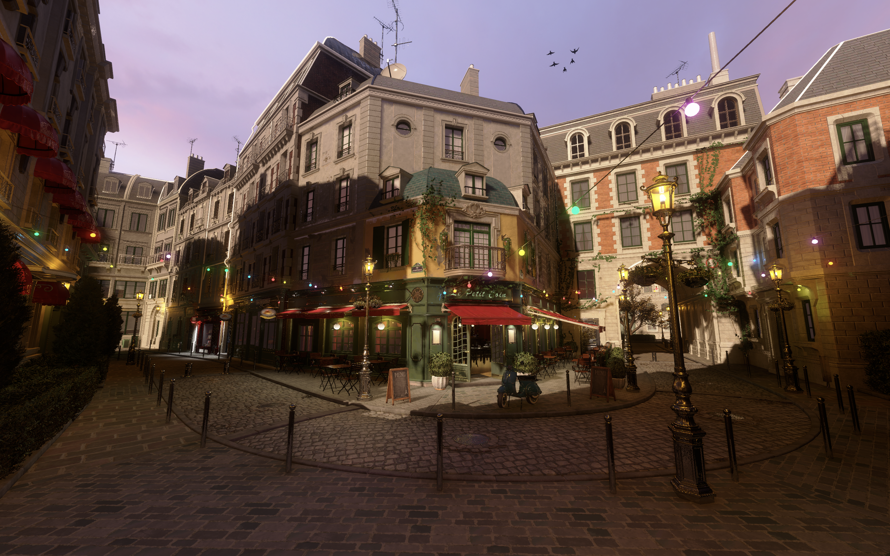
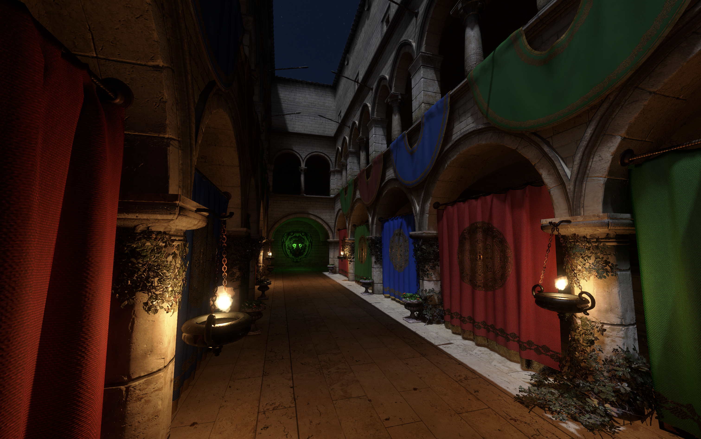

# Vulkan Engine


Cross-platform C++20 Vulkan 1.3+ GPU-driven clustered forward renderer with an integrated editor, built from scratch as a personal project to explore real-time graphics and engine architecture. Produces a shared library and an app.

**Built with:** C++20 · Vulkan 1.3 (Vulkan-Hpp, VMA, dynamic rendering, timeline semaphores) · Slang shaders · GLFW · Jolt Physics · Dear ImGui + ImGuizmo · meshoptimizer · KTX-Software · TinyGLTF + MikkTSpace · Catch2 · Tracy (optional)

## Table of Contents

- [Features](#features)
- [Requirements](#requirements)
  - [Downloads](#downloads)
- [Quick start with scripts](#quick-start-with-scripts)
  - [macOS, Linux, Windows (MinGW)](#macos-linux-and-windows-mingw64-shell)
  - [Windows (cmd or PowerShell)](#windows-cmd-or-powershell)
- [Manual build](#manual-build)
  - [Unix or MinGW shell](#unix-or-mingw64-shell)
  - [Windows with MSVC](#windows-with-msvc)
- [Build options](#build-options)
- [Running the sandbox](#running-the-sandbox)
- [Tests](#tests)
- [Benchmarks and visual regression](#benchmarks-and-visual-regression)
- [Credits](#credits)





## Features

#### Rendering
- Modern Vulkan 1.3: dynamic rendering, timeline semaphores, Vulkan-Hpp RAII
- PBR (physically based rendering) for .gltf models
- Clustered forward rendering with depth pre-pass and infinite reverse-Z
- Image-Based Lighting
- Order-independent transparency (WBOIT)
- Bindless textures with KTX2 (BC7/ASTC) transcoding
- GPU-driven rendering: frustum + Hi-Z occlusion culling, multi-draw indirect, draw compaction
- Meshlet pipeline with two-pass meshlet culling
- Automatic LOD selection
- Multi-threaded command buffer recording with secondary command buffers
- Shaders written in Slang, compiled to SPIR-V at build time
- Screen space reflections
- Specialization-constant pipeline variants, cached to disk between runs

#### Lighting & Shadows
- Point lights, directional lights, spot lights, area lights
- Cascaded Shadow Maps, plus a packed atlas for point and spot shadows
- Screen-space shadow mask (compute), PCF, PCSS
- GTAO (Ground Truth Ambient Occlusion)
- Global illumination: world-space [Split Radiance Cascades](https://arxiv.org/abs/2607.20384) - sparse probe hashmaps with a screen space
ray marcher

#### Architecture
- Shared-library + app split
- Custom ECS with typed component pools, parent/child hierarchy
- Engine-wide event bus and separate ECS-local event dispatcher
- Refcounted, type-keyed resource handles with auto-unload
- Per-frame primary and per-thread secondary command buffer management
- Async glTF loading

#### Simulation
- Rigid-body physics via Jolt
- Character controller on Jolt's CharacterVirtual
- Skeletal animation: glTF skin import, keyframed TRS clips, compute skinning, morph targets
- Animation blending: per-clip weights, cross-fade, 1D blend spaces
- Third-person follow camera with a physics-probed spring arm
- Compute-based particle system, async on a dedicated compute queue when available

#### Post-processing & Effects
- Bloom
- HDR with several tone mapping options
- Fireworks demo, app-side example built on top of the engine's particle system
- Skybox
- MSAA


#### Editor & Tools
- Dear ImGui docked UI with hierarchy, inspector, viewport, asset browser, graphics settings, performance, environment and debug panels
- ImGuizmo 3D transform gizmos
- Outline rendering for selected entities
- Debug views: normals, tangents, normal maps, shadow cascades, cluster heatmap, LOD level, meshlet ID, GI irradiance and sky visibility
- Headless benchmark mode with per-pass timings, deterministic counters and golden-image comparison
- Tracy profiler integration (optional)
- Cross-platform builds: Windows (MSVC or MinGW), macOS, and Linux
- FPS-style camera (WASD + mouse)


## Requirements

- Git
- CMake ≥ 3.20
- C++20 toolchain: Clang 14+, MSVC 2019+, or GCC 11+
- Vulkan SDK ≥ 1.3 with Slang compiler

Fetched automatically if not found on the system:
- KTX-Software 4.4.2, GLFW 3.3.9, GLM 1.0.1, meshoptimizer 1.0, Jolt Physics 5.5.0
- Catch2 3.5.2 when tests are enabled, Tracy 0.13.1 when profiling is enabled

Included in `external/`:
- TinyGLTF, Dear ImGui, ImGuizmo, Mikktspace, Portable File Dialogs, Vulkan Memory Allocator, AMD FidelityFX SPD (Hi-Z downsampler)

The sandbox scenes and their models are in the repository, so there is nothing to download before running.


#### Downloads:
Besides git, cmake and a c++20 compiler, the Vulkan SDK must be installed manually.

- Vulkan SDK (LunarG): https://vulkan.lunarg.com/sdk/home
	- macOS and Windows: Check 'System global installation' component in the installer
	- Linux: Consult https://vulkan.lunarg.com/doc/sdk/1.4.328.1/linux/getting_started.html (1.4.328) for instructions to install the tar file.

- Extra (fetched automatically, but can be installed manually):
	- KTX: https://github.com/KhronosGroup/KTX-Software/releases
	- Slang (if not included in your Vulkan SDK): https://github.com/shader-slang/slang/releases
	- GLFW: https://www.glfw.org/download.html
	- GLM: https://github.com/g-truc/glm/releases

- Additional packages for fresh ubuntu install:
```bash
sudo apt update
sudo apt upgrade
sudo apt install git cmake xorg-dev libglfw3-dev libglm-dev libxcb-xinerama0-dev libxcb-xinput-dev libxcb-cursor-dev
```


## Quick start with scripts
After installing all the dependencies, we can build and run with one script.

- ##### macOS, Linux and Windows (MinGW64 shell):
Optional arguments include [debug|release|test|tracy|leaks|clean] and [no-vk-val]. Default is release.
```bash
cd vulkan_engine
./unixBuild.sh
```

- ##### Windows (cmd or PowerShell):
Optional arguments include [debug|release|test|tracy|clean] and [vs2022|vs2026]. Default is release vs2026.
```cmd
cd vulkan_engine
.\windowsBuild.bat
```

## Manual build
From repository root:

##### Unix or MinGW64 shell:

```bash
cmake -S . -B build/Release -DCMAKE_BUILD_TYPE=Release
cmake --build build/Release
./build/Release/VeApp
```

##### Windows with MSVC:

From command prompt:

```bat
cmake -S . -B build -G "Visual Studio 18 2026" -A x64
cmake --build build --config Release
build\Release\VeApp.exe
```

Or generate VeApp.sln to open with Visual Studio:

```bat
cmake -S . -B build -G "Visual Studio 18 2026" -A x64
```

Then, in VS, right-click the VeApp target, set as startup project, build and then run (f5)

## Credits

Huge thanks to:

- Brendan Galea for his excellent Vulkan video series: https://www.youtube.com/@BrendanGalea
- The Khronos Vulkan Tutorial: https://docs.vulkan.org/tutorial/latest/00_Introduction.html
- Physically Based Rendering in Filament: https://google.github.io/filament/Filament.md.html
- Vulkan samples by Sascha Willems: https://github.com/SaschaWillems/Vulkan
- Rouli Freeman and Alexander Sannikov, "Split Radiance Cascades: Real-Time Global Illumination via Sparse Radiance Probes": https://arxiv.org/abs/2607.20384
