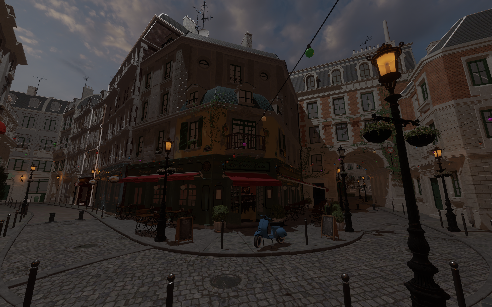
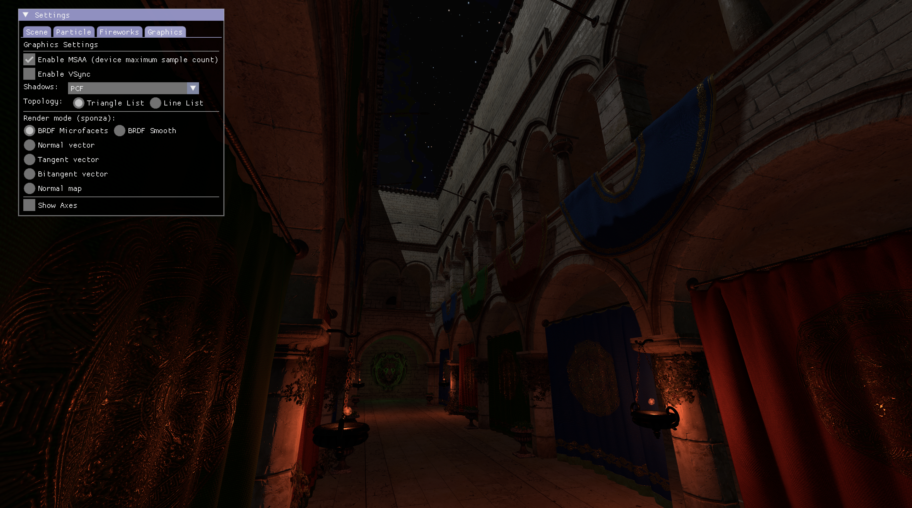
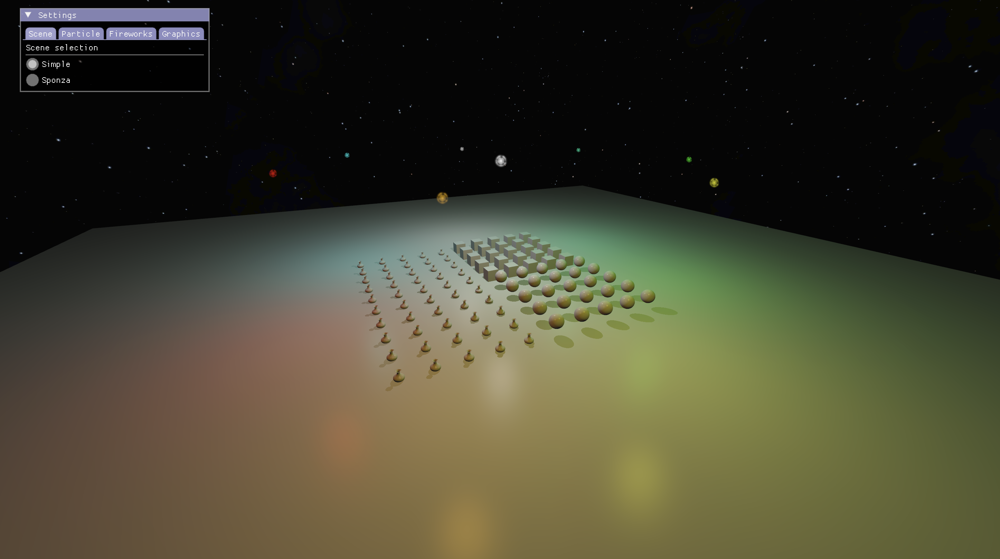
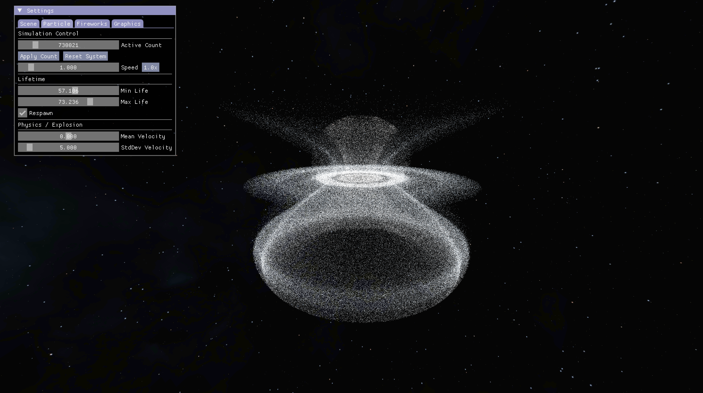
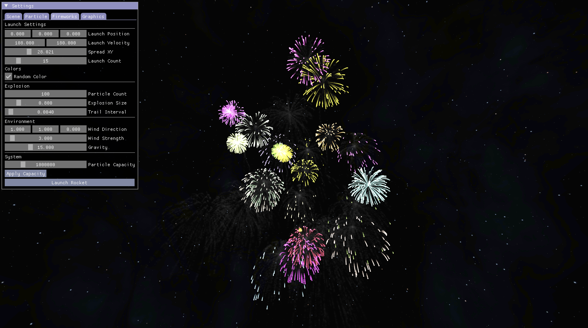

# Vulkan Engine



Small modern cross-platform C++20 Vulkan 1.3+ clustered forward renderer using GLFW and Slang. Produces a shared library (`VEngineLib`) and an app (`VeApp`). The goal of this project is for me to have fun and to learn more about graphics programming!


## Table of Contents

- [Features](#features)
- [Requirements](#requirements)
  - [Downloads](#downloads)
- [Quick start with scripts](#quick-start-with-scripts)
  - [macOS, Linux, Windows (MinGW)](#macos-linux-and-windows-mingw64-shell)
  - [Windows (cmd or PowerShell)](#windows-cmd-or-powershell)
- [Manual build](#manual-build)
  - [Unix or MinGW shell](#unix-or-mingw64-shell)
  - [Windows (Visual Studio)](#windows-with-visual-studio)
- [Controls](#controls)
- [Credits](#credits)







## Features
- Modern Vulkan: dynamic rendering, Vulkan-Hpp RAII
- Cross-platform builds: Windows (MSVC or MinGW), macOS, and Linux
- PBR for .gltf models like Sponza and Bistro
- Particle system with compute shaders
- Fireworks using the particle system
- Clustered forward rendering with depth pre-pass
- Point lights, Directional lights
- Shadows: CSM, Screen Space Shadows with compute, PCF, PCSS
- GTAO
- Post-processing effects like Bloom and Blur
- Basic HDR, several tone mapping options
- Dear ImGui overlay
- Skybox
- FPS-style camera
- MSAA
- Frustum culling


## Requirements

- Git
- CMake ≥ 3.16
- C++20 toolchain: Clang 14+, MSVC 2019+, or GCC 11+
- Vulkan SDK ≥ 1.3 with Slang compiler

Fetched automatically if not found on the system:
- KTX, GLFW 3.3+, GLM, Meshoptimizer

Included in `external/`:
- TinyGLTF, Dear ImGui, Mikktspace, Portable File Dialogs


#### Downloads:
Besides git, cmake and a c++20 compiler, the Vulkan SDK must be installed manually. KTX is fetched automatically if not found on the system.

- Vulkan SDK (LunarG): https://vulkan.lunarg.com/sdk/home
	- macOS and Windows: Check 'System global installation' component in the installer
	- Linux: Consult https://vulkan.lunarg.com/doc/sdk/1.4.328.1/linux/getting_started.html (1.4.328) for instructions to install the tar file.

- Extra (fetched automatically, but can be installed manually):
	- KTX: https://github.com/KhronosGroup/KTX-Software/releases
	- Slang (if not included in your Vulkan SDK): https://github.com/shader-slang/slang/releases
	- GLFW: https://www.glfw.org/download.html
	- GLM: https://github.com/g-truc/glm/releases

- Additional packages for fresh ubuntu install:
```bash
sudo apt update
sudo apt upgrade
sudo apt install git cmake xorg-dev libglfw3-dev libglm-dev libxcb-xinerama0-dev libxcb-xinput-dev libxcb-cursor-dev
```


## Quick start with scripts
After installing all the dependencies, we can build and run with one script.

- ##### macOS, Linux and Windows (MinGW64 shell):
Optional arguments include [release|debug|test|clean]. Default is release.
```bash
cd vulkan_engine
./unixBuild.sh
```

- ##### Windows (cmd or PowerShell):
Optional arguments include [release|debug|test|clean] and [vs2022|vs2026]. Default is release vs2026.
```cmd
cd vulkan_engine
.\windowsBuild.bat
```

## Manual build
From repository root:

##### Unix or MinGW64 shell:

```bash
cmake -S . -B build/Release -DCMAKE_BUILD_TYPE=Release
cmake --build build/Release
./build/Release/VeApp
```

##### Windows with MSVC:

From command prompt:

```bat
cmake -S . -B build -G "Visual Studio 18 2026" -A x64
cmake --build build --config Release
build\Release\VeApp.exe
```

Or generate VeApp.sln to open with Visual Studio:

```bat
cmake -S . -B build -G "Visual Studio 18 2026" -A x64
```

Then, in VS, right-click the VeApp target, set as startup project, build and then run (f5)

## Controls

- Camera: WASD/C/Space and Shift to move, arrow keys or mouse to look
- UI toggle: Tab
- Particle modes: 1 / 2 / 3 / 4 / 5
- Reset particles: E (explosion) or G (rotating disk)
- Launch fireworks: F
- Escape to exit the application

## Credits

Huge thanks to:

- Brendan Galea for his excellent Vulkan video series: https://www.youtube.com/@BrendanGalea
- The Khronos Vulkan Tutorial: https://docs.vulkan.org/tutorial/latest/00_Introduction.html
- Physically Based Rendering in Filament: https://google.github.io/filament/Filament.md.html
- Vulkan samples by Sascha Willems: https://github.com/SaschaWillems/Vulkan